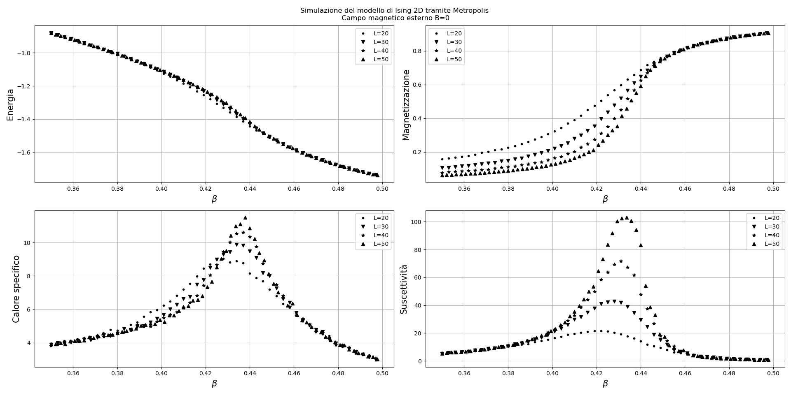
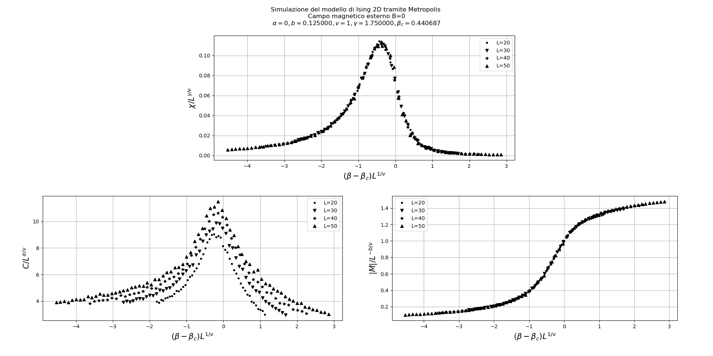

The code that performs the simulation is ising2d.c. Plotising.py makes the graphs which are shown below. Ising.py creates the lattice animation.
The ising model is an attempt to simulate the structure of a physical ferromagnetic substance, or more accurately, to simulate a domain in a ferromagnetic substance (or anti-ferromagnetic).
We will consider a 2-dimensional periodic lattice. Associated with each lattice site is a spin variable which is a number that is eitheir +1 or -1.
The hamiltonian of the system is:

<a href="https://www.codecogs.com/eqnedit.php?latex=\mathcal{H}&space;=&space;-J\sum_{<ij>}&space;\sigma_i&space;\sigma_j&space;-&space;B\sum_{i=0}^N&space;\sigma_i" target="_blank">}&space;\sigma_i&space;\sigma_j&space;-&space;B\sum_{i=0}^N&space;\sigma_i" title="\mathcal{H} = -J\sum_{<ij>} \sigma_i \sigma_j - B\sum_{i=0}^N \sigma_i" /></a>

J>0 corresponds to the ferromagnetic case, J<0 anti-ferromagnetic case.
The partition function and the interesting thermodynamic quantities are:

<a href="https://www.codecogs.com/eqnedit.php?latex=\\&space;\mathcal{Z}(B,T)=&space;\sum_{\sigma_1}&space;\sum_{\sigma_2}&space;\cdots&space;\sum_{\sigma_N}&space;e^{H/(K_B&space;T)}\\&space;\\&space;F(B,T)=-K_B&space;T&space;\ln(\mathcal{Z}(B,T))\\&space;\\&space;U(B,T)=-K_B&space;T^2&space;\frac{\partial}{\partial&space;T}\Biggl(\frac{F(B,T)}{K_B&space;T}\Biggr)\\&space;\\&space;C(B,T)=\frac{\partial&space;U(B,T)}{\partial&space;T}\\&space;\\&space;M(B,T)=-\frac{\partial}{\partial&space;B}\Biggl(\frac{F(B,T)}{K_B&space;T}\Biggr)=&space;\Biggl<&space;\sum_{i=1}^N&space;\sigma_i&space;\Biggr>" target="_blank">" title="\\ \mathcal{Z}(B,T)= \sum_{\sigma_1} \sum_{\sigma_2} \cdots \sum_{\sigma_N} e^{H/(K_B T)}\\ \\ F(B,T)=-K_B T \ln(\mathcal{Z}(B,T))\\ \\ U(B,T)=-K_B T^2 \frac{\partial}{\partial T}\Biggl(\frac{F(B,T)}{K_B T}\Biggr)\\ \\ C(B,T)=\frac{\partial U(B,T)}{\partial T}\\ \\ M(B,T)=-\frac{\partial}{\partial B}\Biggl(\frac{F(B,T)}{K_B T}\Biggr)= \Biggl< \sum_{i=1}^N \sigma_i \Biggr>" /></a>

M(0, T) is called spontaneus magnetization; if it is nonzero the system is said to be ferromagnetic.
It's clear that hamiltonian is invariant in absence of an external field, when all spin change simultaneously. 
Therefore for B=0 the magnetization as defined is zero but we know that this is physically the wrong answer, for we do have ferromagnets in nature.
The rip off is in the ground state of Hamiltonian that does not possess the aforementioned symmetry; as we can see from the Hamiltonian, the ground state has spins aligned so it is not rotationally invariant because the magnetization points along a definite axis in space.
The essential point is that magnetization system cannot make a transistion to another direction because this would require all spins to rotate simultaneously and spontaneously in the same way (slightly difficult thing).
So we have a spontaneus simmetry breaking; the correct  approach would be to consider an external field different from zero and therefore, first carry out the thermodynamic limit, and then send the external field to zero.

  

